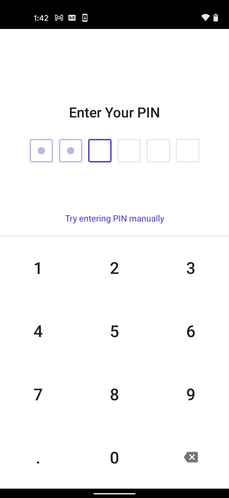

# react-native-isiosapponmac

Interface is similar to AsyncStorage, aside from pin on android

## Getting started

`$ npm install react-native-isiosapponmac --save`

### Mostly automatic installation

`$ react-native link react-native-isiosapponmac`

## iOS notes

1. Add a NSFaceIDUsageDescription entry in your Info.plist.

2. Please also note these three lines in Podfile in the example/ios folder:
```
plugin 'cocoapods-user-defined-build-types'
enable_user_defined_build_types!
pod 'IsIosAppOnMac', :build_type => :dynamic_framework
```

3. You have to install ruby and run `bundle install` once in the ios folder. After that, you will always do `bundle exec pod install` instead of `pod install`

## Android notes
On android, we should get a 6-digit pin from user that looks like:



## Usage
```javascript
import {Platform} from 'react-native';
import {Keychain} from 'react-native-isiosapponmac';

// Must not be changed
const getService = () => {
    if (Platform.OS === 'android') {
        return 'protonsdk.secure_keys'
    } else if (Platform.OS === 'ios') {
        return 'proton.swift'
    } else {
        throw new Error('Unsupported Platform')
    }
}

const KeychainService = new Keychain(getService());

// Get 6-digit pin from user (Android only)
const params = {
    pin: Platform.OS === 'android' ? '123456' : undefined,
};

const key = 'PUB_K1_55VzHNofSRiJbQ5P9XWqNba2DXanF2KcCYby2EcRXyMxF5ki6k';
const value = 'PVT_K1_2eU3nimmx21gR8Z4zAtmkBTDtfiKz4j1Q7EWGSMJ9QurgQ8ECr';
const fakeKey = 'PUB_K1_7Zyp3EKYb6V9Q78tWdnnxyijFVkTGV4LcyBXwekP8EXqppFAKE';

const setItem = await KeychainService.setItem(key, value, params);
console.log(`setItem (${key} | ${value})`, setItem);

const getItem = await KeychainService.getItem(key, params);
console.log(`getItem (${key})`, getItem);

const hasItem = await KeychainService.hasItem(key);
console.log(`hasItem (${key})`, hasItem);

const hasItem2 = await KeychainService.hasItem(fakeKey);
console.log(`!hasItem (${fakeKey})`, hasItem2);

if (Platform.OS === 'android') {
    try {
        console.log('Wrong 6 Digit Pin (getItem) - Throws error');
        await KeychainService.getItem(key, { pin: '122200' });
    } catch (e) {
        console.error(e);
    }
}

const getAllKeys = await KeychainService.getAllKeys();
console.log('getAllKeys', getAllKeys);

const getWrongItem = await KeychainService.getItem(fakeKey, params);
console.log(`Get Wrong Item (${fakeKey}):`, getWrongItem);

const removeItem = await KeychainService.removeItem(key);
console.log(`removeItem (${key}`, removeItem);

const getRemovedItem = await KeychainService.getItem(key, params);
console.log(`Get Removed Item (${key})`, getRemovedItem);
```

